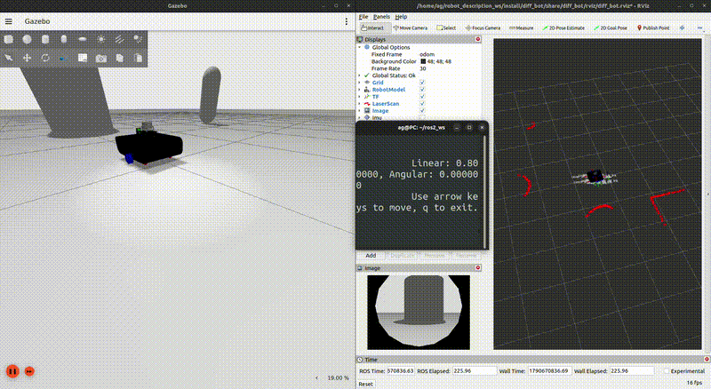
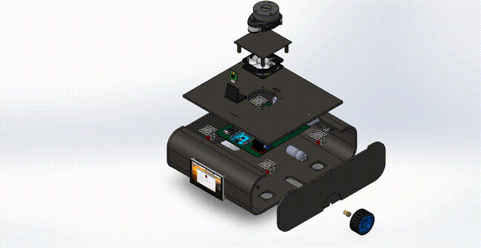
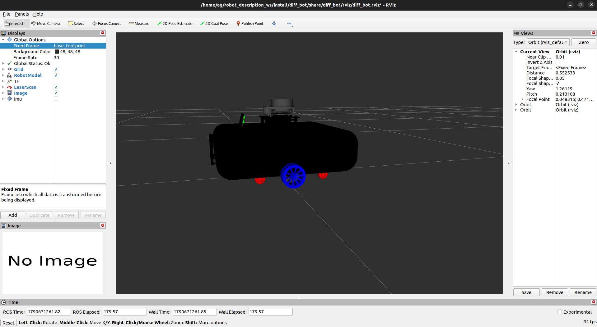

# ROS 2 Robot Description & Digital Twin

**From robot modeling and CAD design to a fully simulated ROS 2 digital twin.**

This workspace demonstrates a complete robotics simulation workflow using **ROS 2 Humble, URDF/Xacro, TF2, RViz2, Gazebo Sim, ros2_control, SolidWorks, and simulated sensors.**

---

## 🎥 Project Demo

### DDR — Basic Robot


### Differential-Drive — CAD Digital Twin





---

## 🚀 Project Overview

The workspace contains two stages of the same differential-drive robotics workflow:

| Project                    | Description                                                                    |
| -------------------------- | ------------------------------------------------------------------------------ |
| **DDR Basic**              | Primitive-based ROS 2 robot for developing and validating the simulation stack |
| **Differential-Drive CAD** | SolidWorks-based robot integrated into ROS 2 as a complete digital twin        |

The workflow:

```text
CAD / Robot Design
        ↓
   Mesh Export
        ↓
    URDF / Xacro
        ↓
       TF2
        ↓
      RViz2
        ↓
    Gazebo Sim
        ↓
   ros2_control
        ↓
 Sensors + ROS 2 Bridge
        ↓
   Digital Twin
```

---

# 🤖 01 — DDR Basic Robot


A primitive-geometry differential-drive robot used to build and validate the ROS 2 robot-description and simulation pipeline.

### Features

* URDF / Xacro
* Modular robot description
* TF2 frame hierarchy
* RViz2
* Gazebo Sim
* `ros2_control`
* `diff_drive_controller`
* Wheel friction tuning
* Odometry
* LiDAR simulation
* Camera simulation
* IMU simulation
* ROS 2 ↔ Gazebo bridge
* Keyboard teleoperation
* Motion testing
* Sensor validation
* Multiple Gazebo worlds

---

# 🤖 02 — Differential-Drive CAD Digital Twin



A complete differential-drive robot designed in **SolidWorks** and integrated into ROS 2.

The CAD model includes the mechanical structure, wheels, motors, sensor mounts, electronics mounting components, and supporting assemblies.

### CAD Components

```text
diff_bot.SLDASM
│
├── Base Assembly
├── Base Plate
├── Side Plates
├── Top Plate
├── PCB Assembly
├── PCB Plate
├── Camera Stand
├── LiDAR Stand
├── Motor Adapters
├── Wheels
├── DC Motors
└── Caster Wheels
```

### CAD → ROS 2

```text
SolidWorks
    ↓
SLDASM / SLDPRT
    ↓
Mesh Export
    ↓
ROS 2 Meshes
    ↓
URDF / Xacro
    ↓
Visual + Collision + Inertial
    ↓
Gazebo Simulation
    ↓
ros2_control
    ↓
ROS 2 Digital Twin
```

---

# 🧩 Robot Description

The CAD robot uses a modular Xacro architecture:

```text
diff_bot/
├── CAD/
├── meshes/
├── urdf/
│   ├── diff_bot.urdf.xacro
│   ├── properties.xacro
│   ├── gazebo.xacro
│   ├── ros2_control.xacro
│   └── diff_bot.csv
├── config/
├── launch/
├── rviz/
├── scripts/
├── worlds/
└── frames/
```

### Robot Frames

```text
odom
└── base_footprint
    └── base_link
        ├── wheel_right_link
        ├── wheel_left_link
        ├── caster_wheel_*
        ├── laser_link
        ├── camera_link
        │   └── camera_optical_frame
        └── imu_link
```

[View TF2 Frame Graph](src/diff_bot/frames/frames.pdf)

---

# 🎮 Control

The differential-drive robot is controlled through:

```text
ROS 2
  ↓
ros2_control
  ↓
diff_drive_controller
  ↓
Wheel Velocity Interfaces
  ↓
Gazebo
```

Main command interface:

```text
/diff_controller/cmd_vel_unstamped
```

The controller publishes odometry and the `odom → base_footprint` transform.

---

# 📡 Simulated Sensors

| Sensor | ROS 2 Topic     |   Rate |
| ------ | --------------- | -----: |
| LiDAR  | `/scan`         |   5 Hz |
| Camera | `/camera/image` |  30 Hz |
| IMU    | `/imu/out`      | 100 Hz |

Sensor data is generated in Gazebo and bridged to ROS 2 using `ros_gz_bridge`.

---

# 🚀 Build

```bash
cd ~/robot_description_ws

colcon build --symlink-install

source install/setup.bash
```

---

# ▶️ Launch

## DDR Basic

```bash
ros2 launch ddr_description gazebo.launch.py
```

## CAD Robot

```bash
ros2 launch diff_bot gazebo.launch.py
```

### Select a World

```bash
ros2 launch diff_bot gazebo.launch.py world_name:=empty
```

```bash
ros2 launch diff_bot gazebo.launch.py world_name:=small_house
```

```bash
ros2 launch diff_bot gazebo.launch.py world_name:=small_warehouse
```

The CAD launch file starts the complete simulation stack:

```text
Gazebo Sim
    +
Robot State Publisher
    +
Robot Spawn
    +
ros_gz_bridge
    +
Joint State Broadcaster
    +
Diff Drive Controller
    +
RViz2
```

---

# 🧪 Scripts

The project includes Bash scripts for common development and validation tasks.

### RViz2

```bash
./src/diff_bot/scripts/rviz.sh
```

### Teleoperation

```bash
./src/diff_bot/scripts/teleop.sh
```

### Motion Test

```bash
./src/diff_bot/scripts/test_motion.sh
```

### Sensor Test

```bash
./src/diff_bot/scripts/test_sensors.sh
```

These scripts provide quick validation of:

* Robot motion
* Velocity commands
* Odometry
* LiDAR publishing
* Camera publishing
* IMU publishing
* Sensor update rates

---

# 🔍 ROS 2 Inspection

### Topics

```bash
ros2 topic list
```

### Controllers

```bash
ros2 control list_controllers
```

### LiDAR

```bash
ros2 topic hz /scan
```

### Camera

```bash
ros2 topic hz /camera/image
```

### IMU

```bash
ros2 topic hz /imu/out
```

### TF2

```bash
ros2 run tf2_tools view_frames
```

```bash
ros2 run tf2_ros tf2_echo odom base_footprint
```

---

# 🧠 TF2 Demo

A standalone `tf2_demo` package is included to demonstrate querying transformations between robot frames using `tf2_ros`.

Example:

```text
base_link
    ↓
laser_link
```

---

# 📁 Workspace Structure

```text
robot_description_ws/
│
├── media/
│   ├── ddr.png
│   ├── ddr_demo.gif
│   ├── diff.png
│   ├── diff_cad.png
│   ├── diff_cad2.png
│   ├── diff_demo.gif
│   ├── diff_animation_cad_demo.gif
│   └── diff_animation_cad.mp4
│
└── src/
    ├── ddr_description/
    │
    ├── diff_bot/
    │   ├── CAD/
    │   ├── config/
    │   ├── frames/
    │   ├── launch/
    │   ├── meshes/
    │   ├── models/
    │   ├── photos/
    │   ├── rviz/
    │   ├── scripts/
    │   ├── urdf/
    │   └── worlds/
    │
    └── tf2_demo/
```

---

# 🛠️ Technology Stack

* **ROS 2 Humble**
* **URDF / Xacro**
* **TF2**
* **RViz2**
* **Gazebo Sim**
* **ros2_control**
* **diff_drive_controller**
* **ros_gz_bridge**
* **SolidWorks**
* **LiDAR**
* **Camera**
* **IMU**
* **Python**
* **Bash**

---

# 📊 Project Status

| Component                  | Status |
| -------------------------- | :----: |
| DDR Basic Robot            |    ✅   |
| URDF / Xacro               |    ✅   |
| TF2                        |    ✅   |
| RViz2                      |    ✅   |
| Gazebo Simulation          |    ✅   |
| ros2_control               |    ✅   |
| Differential-Drive Control |    ✅   |
| Sensor Simulation          |    ✅   |
| ROS 2 ↔ Gazebo Bridge      |    ✅   |
| SolidWorks CAD             |    ✅   |
| CAD → ROS 2 Integration    |    ✅   |
| CAD Digital Twin           |    ✅   |
| Motion Testing             |    ✅   |
| Sensor Testing             |    ✅   |

---

# 🎯 Scope

This repository focuses on the **robot description and simulation layer** of a robotics software stack.

### Covered

**Modeling → CAD → Robot Description → TF2 → Visualization → Simulation → Control → Sensors → Digital Twin**

Higher-level systems such as **SLAM, Navigation, autonomous task planning, and application-level robotics** are outside the scope of this repository.

---

# 👨‍💻 Author

**Ahmed Gaber**

Mechatronics Engineer | Robotics Software Engineer

**ROS 2 • C++ • Python • Embedded Systems • Robotics • AI**

